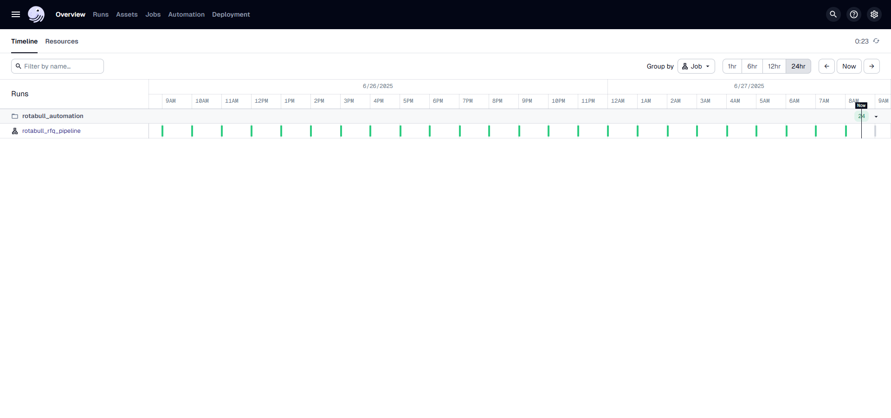

# Rotabull Automation Documentation

## Module 1: Dagster Automation Pipelines

### Description

**Rotabull Automation** is the data orchestration module built with [Dagster](https://dagster.io/) to automate workflows for Joy Aviation involving RFQ (Request for Quote) processing and rolling sheet operations, likely supporting aviation and logistics-related use cases.

### ETL Workflow


### Key Features

- Modular Dagster pipeline for RFQ handling
- Rolling sheet operation as a Dagster op
- Job scheduling and definitions via Dagster's assets and schedules
- Configurable helper utilities for general-purpose processing
- Unit test coverage for core data assets

### Technology Stack

- **Languages**: Python 3
- **Frameworks**: Dagster
- **Build System**: setuptools + pyproject.toml
- **Testing**: pytest

### Project Architecture

```
rotabull_automation/
├── assets.py                # Main asset definitions for Dagster
├── jobs/fetch_rfqs.py      # Job definitions to fetch RFQs
├── ops/rolling_sheet.py    # Reusable ops (operations) like rolling sheet
├── schedules/schedules.py  # Schedules for triggering jobs
├── helpers/                # Shared helper functions
├── definitions.py          # Consolidates assets, jobs, schedules for Dagster
rotabull_automation_tests/
└── test_assets.py          # Unit tests
```

### Use Cases

- Automate processing of incoming RFQs in a scalable way
- Maintain and update rolling sheets programmatically
- Schedule and monitor data jobs using Dagster
- Enable data observability and lineage via Dagster UI

## 2. Getting Started

### Prerequisites

- Python 3.8+
- pip
- Git

### Installation Guide

1. Clone the repository:

```bash
git clone <repo_url>
cd rotabull_automation
```

2. Install dependencies in development mode:

```bash
pip install -e ".[dev]"
```

3. Start Dagster UI:

```bash
dagster dev
```

4. Open your browser at `http://localhost:3000`

### Quick Start

```bash
pip install -e ".[dev]"
dagster dev
```

Navigate to Dagster UI and launch jobs from the UI.

### Configuration

- **workspace.yaml**: Declares the Dagster code location and module
- **Environment variables**: Optional for secrets/configs
- **setup.cfg**: Metadata for building the project

### Verification

- Launch Dagster UI



- Confirm that jobs appear in the jobs section


- Run the test suite:

## 3. Detailed Usage Guide

### Core Functionality

The core functionality is implemented as Dagster assets and jobs:

- `assets.py` defines key Dagster assets such as rolling sheet operations.
- `fetch_rfqs.py` defines a Dagster job for fetching RFQs using custom ops.
- `rolling_sheet.py` contains reusable business logic as Dagster ops.

### API Documentation

This project is not an HTTP API but uses Dagster's programmatic APIs internally.
Each op and asset is defined as a Python function decorated with Dagster-specific decorators such as `@asset` or `@op`.

Example:
```python
@op
def get_rolling_rfq():
    ...
```

### Command Line Interface

This project is operated through Dagster CLI:

- `dagster dev` — Launch development Dagster web UI
- `dagster job list` — List available jobs
- `dagster job launch -j <job_name>` — Launch specific job

### User Interface Guide

Once running, Dagster UI is available at `http://http://34.228.61.119:3000`. From there, users can:

- Visualize asset lineage
- Launch jobs manually
- Inspect run history and logs
- Initiate a and Monitor schedules

### Integration Examples

You can integrate this Dagster project with external services (e.g., data sources or APIs) by:

- Adding secrets and config to environment variables or YAML config
- Extending ops with API client logic in Python
- Scheduling data syncs or operations using `schedules/schedules.py`

Example extension point:
```python
@op
def fetch_rfqs(context):
    api_key = os.getenv("RFQ_API_KEY")
    # Call API and return results
```

## 4. Code Structure and Architecture

### Directory Structure

```
rotabull_automation/
├── __init__.py
├── assets.py                # Defines Dagster assets
├── definitions.py           # Assembles jobs, schedules, and assets
├── helpers/
│   └── helper_functions.py  # Utility functions used in assets/ops
├── jobs/
│   └── fetch_rfqs.py        # Dagster job using RFQ-related ops
├── ops/
│   └── rolling_sheet.py     # Dagster op for rolling sheet logic
├── schedules/
│   ├── __init__.py
│   └── schedules.py         # Defines Dagster schedules
rotabull_automation_tests/
└── test_assets.py           # Unit tests for Dagster assets
```

### Key Components

- **assets.py**: Central definition of assets including their dependencies
- **rolling\_sheet.py**: Contains the `@op`-based logic to generate or update rolling sheets
- **fetch\_rfqs.py**: Builds a Dagster `@job` that calls ops to fetch and process RFQs
- **schedules.py**: Associates jobs to time-based schedules for automation
- **definitions.py**: Main registry for Dagster to gather jobs/assets/schedules into a code location
- **helper\_functions.py**: Abstractions used by ops and assets to avoid duplication

### Data Flow

1. **Schedule triggers job** Fetch RFQs
2. **Dagster job** runs the appropriate `@op`
3. **Ops** call helper functions and external APIs to gather/process data
4. **Asset outputs** are tracked and stored via Dagster

### Design Patterns

- **Functional Ops**: Each op encapsulates a specific task (e.g., fetch, transform)
- **Asset-based Pipelines**: Modular and composable asset definitions (Note: Note implemented as of now)
- **Separation of Concerns**: Helper functions are extracted for reuse and clarity
- **Centralized Definitions**: `definitions.py` acts as the single point of registration

## 5. Development Guide

### Development Environment Setup

To set up a development environment:

1. Clone the repository:
```bash
git clone <repo_url>
cd rotabull_automation
```

2. Create and activate a virtual environment (optional but recommended):
```bash
python -m venv venv
source venv/bin/activate  # or venv\Scripts\activate on Windows
```

3. Install dependencies in editable mode:
```bash
pip install -e ".[dev]"
```

4. Launch Dagster UI locally:
```bash
dagster dev
```

### Code Standards

- Follow PEP8 for Python style
- Use snake_case for functions and variables, PascalCase for class names
- Organize assets, ops, and jobs in their respective modules
- Include docstrings for all functions and classes

### Building and Deployment

This project is built as a Python package:
- Build metadata defined in `setup.py` and `pyproject.toml`
- Deployments can be done using Docker, Dagster Cloud, or CI/CD workflows

Example build:
```bash
python setup.py sdist bdist_wheel
```

## 6. Configuration and Customization

### Configuration Files

- **workspace.yaml**: Defines Dagster code location
- **setup.cfg**: Metadata for setuptools build
- **pyproject.toml**: Additional metadata and dependency declaration

### Environment Variables

Common environment variables (set these in your shell or `.env` file):

- `RFQ_API_KEY`: API key for accessing external RFQ sources
- `ROLLING_SHEET_PATH`: File path or identifier for saving sheet outputs

Use `os.getenv("VAR_NAME")` in your Python code to access these.

### Customization Options

You can customize pipeline behavior by modifying or extending:

- **Ops**: Write new ops in `ops/` and register in jobs
- **Jobs**: Assemble jobs from custom ops in `jobs/`
- **Schedules**: Add time-based job triggers in `schedules/`

Example: Adding a new asset

```python
@asset
def process_new_data():
    ...
```

### Performance Tuning

- Use Dagster's memoization to cache outputs if upstream inputs haven't changed
- Minimize I/O in ops where possible
- Run performance-critical ops asynchronously or in parallel if needed
- Profile execution with `dagster dev --log-level DEBUG`

### Security Settings

- Avoid hardcoding secrets; use environment variables or a secret manager (dotend used for now)
- Limit access to sensitive configuration files
- Secure the Dagster web UI with authentication when deployed publicly
- Sanitize logs to avoid leaking sensitive information

## 7. Error Handling and Troubleshooting

### Common Error Messages

| Error Message | Cause | Solution |
|---------------|-------|----------|
| `ModuleNotFoundError` | Missing dependency | Run `pip install -e .[dev]` again |
| `DagsterInvariantViolationError` | Invalid op or asset definition | Check function decorators and return types |
| `Schedule not found` | Schedule not registered | Ensure it's included in `definitions.py` |

### Debug Mode

Enable debug logging by running:
```bash
dagster dev --log-level DEBUG
```
This will print verbose logs to help trace errors and unexpected behavior.

### Performance Issues

- Monitor long-running ops using Dagster UI
- Profile execution with `cProfile` or built-in timers
- Ensure that ops are not performing redundant or blocking operations

### Compatibility Problems

- Python 3.8+ is required
- Check Dagster version compatibility with `pip list | grep dagster`
- Use `pip freeze` to create a reproducible `requirements.txt`

### Recovery Procedures

- For failed runs, use Dagster UI to retry specific steps [(Visit Rotabull-Automation Job)]("http://34.228.61.119:3000/locations/rotabull_automation/jobs/rotabull_rfq_pipeline")
- Review logs and intermediate results in the run detail panel
- If critical files are corrupted, revert from git repository

### Log Analysis

Dagster stores run logs with timestamps and structured messages:
- Check logs in Dagster UI for each job run
- Use `context.log` in ops to emit custom debug messages:

```python
@op
def sample_op(context):
    context.log.info("Starting operation...")
```

---

## Module 2: Google Sheets Automation JAF

**Description:** JAF Sheets Automation is a Python based Flask server that allows us to havr the ability to automatically fetch results on the google sheets from the staging database designed to extract current week RFQs for JAF every week. The database is updated every hour with new records from the Rotabull. The users can retrieve this data on to the google sheets using the custom side bar designed within the google sheets using the Google App Script tools. This ocument covers a detailed guide on the features of the API, automation scripts, and how to use them.

**Key Features:**

- Integration with Google Sheets for real-time data synchronization
- Configurable via JSON-based formulas and environment variables
- Dockerized deployment for consistent environments
- REST search API for querying processed data
- Comprehensive unit tests and error handling mechanisms

**Technology Stack:**

- **Languages:** Python 3.12, JavaScript (Node.js), HTML, CSS
- **Frameworks/Libraries:** Pandas, Requests, Pytest, Google API Client
- **Infrastructure:** Docker, Docker Compose
- **Configuration:** JSON, YAML
- **Version Control:** Git

**Project Architecture:** The system is structured into several components:

1. **Data Ingestion:** `rotabull_etl.py` holds necessary functions to support querying data from the database, transforming it to be presented on the google sheets in an understandable format.
2. **Transformation Modules:** Python scripts (`raw_functions.py`, `sql_operations.py`, `raw_sheet_integration.py`) implement data transformations, SQL loading logic, and sheet integration.
3. **API Layer:** 
Node.js scripts (`search-api.js`, `app-scripts.js`) provide REST endpoints for querying processed data.   
- The `search-api.js` suppoerts functions and features for the custom dashboard (coming up next).
- The `app-scripts.js` holds the functions and features for google app scripts application to enable users easilyt interact with the server with a GUI
4. **Deployment:** `docker-compose.yaml`, and `DockerFile` define containerized deployment.
5. **Testing:** Unit tests under the `Tests/` directory ensure pipeline reliability.

**Use Cases:**

- Providing a searchable API endpoint for RFQ data to integration partners.
- Allow users to interact with the database through the google sheets

---

# Getting Started

## Prerequisites

- **Operating System:** Windows, macOS, or Linux
- **Python Version:** 3.12 or higher
- **Node.js Version:** 18 or higher
- **Docker:** Docker Engine 20.10+
- **Google API Credentials:** Required for Sheets integration
- **Environment Variables:** Defined in `.env` or passed into the Docker container

## Installation Guide

### Local Installation

1. **Clone the Repository:**

```bash
git clone -b Faisal <repository-url>
```

2. **Create and Activate Virtual Environment:**

On Linux or macOS:
```bash
python -m venv venv
source venv/bin/activate
```

On Windows:

```bash
venv\Scripts\activate
```

3. **Install Python Dependencies:**

```bash
pip install -r requirements.txt
```

4. **Run the flask server**

```bash
pytho app.py
```

## Quick Start

## Configuration

- **Environment Variables:** Update the environment variable in the `.env`, such as:

```bash
# Database Configuration
MYSQL_ROOT_PASSWORD="your_root_password"
MYSQL_USER="your_database_user"
MYSQL_PASSWORD="your_database_password"
DB_HOST= "your_database_host"
DB_NAME="your_database_name"

# API Configuration
JWT_SECRET=your_jwt_secret_key

# Integration Credentials
ROTABULL_API_KEY="your_api_key"
GOOGLE_SHEETS_ID="your_google_sheets_id"
GOOGLE_SHEETS_CREDENTIALS="your_google_sheets_creds_file"
```

- **Formula Files:** The `config/formulas.json` holds custom formulas for the following columns in the sheets that need to be updated:

1. Column G: No of Quotes (pn) -> pn_formula_template
2. Column H: Date JA Quoted -> jaq_formula_template
3. Column I: No of Quotes (cd) -> cd_formula_template
4. Column P: Ready to Quote -> rtq_formula_template
5. Column Q: Sourcing Price -> sp_formula_template
6. Column R: Comments -> comments_formula_template

```json
{
  "pn_formula_template": "=COUNTIF('Raw Data Sheet'!B:B, C{row_num}) - COUNTIFS('Raw Data Sheet'!B:B, C{row_num}, 'Raw Data Sheet'!M:M, \"Joy Aviation\")",
  "jaq_formula_template": "=INDEX('Raw Data Sheet'!S:S, MATCH(1, ('Raw Data Sheet'!B:B = C{row_num}) * ('Raw Data Sheet'!M:M = \"Joy Aviation\"), 0))",
  "cd_formula_template": "=VLOOKUP(C{row_num},IMPORTRANGE(\"https://docs.google.com/spreadsheets/d/13Zb0GIPLXdAgGt1b1ecScd7_URdUutWBptnpCBYiCAk/edit?gid=1958093213#gid=1958093213\",\"06/19!B:N\"),13,FALSE)",
  "rtq_formula_template": "=IF(AND((MATCH(C{row_num}, 'Raw Data Sheet'!B:B, 0)), INDEX('Raw Data Sheet'!M:M, MATCH(C{row_num}, 'Raw Data Sheet'!B:B, 0)) <> \"Joy Aviation\", OR(INDEX('Raw Data Sheet'!F:F, MATCH(C{row_num}, 'Raw Data Sheet'!B:B, 0)) = \"\", INDEX('Raw Data Sheet'!F:F, MATCH(C{row_num}, 'Raw Data Sheet'!B:B, 0)) = \"x\")), \"NO\", \"YES\")",
  "sp_formula_template": "=IFERROR(INDEX('Raw Data Sheet'!F:F, MATCH(1, ('Raw Data Sheet'!B:B = B{row_num}) * ('Raw Data Sheet'!M:M <> \"Joy Aviation\") * ('Raw Data Sheet'!F:F <> \"\"), 0)), 0)",
  "comments_formula_template": "=VLOOKUP(C{row_num},'Raw Data Sheet'!B:E,4,FALSE)"
}
```

These formulas define the information in the respective columns based on other values in the reference columns. These columns are dynamically updated by `update_rolling_sheet` function within `rotabull_etl.py`

---

# Detailed Usage Guide

## Core Functionality

- The core functionality centers around fetching results on google sheets from the database upon user input into the custom tootls side bar on the sheets:


- The user can select the date range in the calender interface to fetch the results from the database on to the google  by clicking the Fetch Data By Date button.

## API Documentation

The API provides a simple REST interface for querying RFQ data from the database:

- **GET /update_rolling_sheet**
  - **Query Params:** `start_date`, `end_date`
  - **Response:** 
    1. success message in json format
    2. Updated rolling sheet

```bash
curl 'http://localhost:5000/update_rolling_sheet'
```

### Example Response

```json
  {
    "Successfully Updated Rolling Sheet"
  }
```

## User Interface Guide

- ### **Google Sheets UI:**
  - The worksheet has two components:
    1. Rolling Sheet
    2. Raw Data Sheet
  - Teh worksheet manages the conditional formatting highlights inconsistencies
  - Custom formulas are added via `config/formulas.json`
  - Google's custom app script also supports the API to dedupe the results by removing duplicate line items from the sheet.
  
#### **Rolling Sheet**
<details>
<b>Description:</b>
The Rolling Sheet contains the line items that Joy Aviation is currently processing. iT contains line items for the ongoing week that are either being sources, have been quoted or just been received from Rotabull. The Rolling Sheet has the following Columns and their descriptions </br></br></br>

```json
{ Rolling Sheet: 
      {
          "Line Item Id": {
          "description": "Unique identifier line items in an RFQ.",
          "example": "45811090"
        },
        "Rfq_Number": {
          "description": "Unique identifier for the RFQ (Request for Quote) submitted by the customer.",
          "example": "ILSCPBU250612233342"
        },
        "Part_number": {
          "description": "Manufacturer or catalog number identifying the requested part.",
          "example": "MS14144L10"
        },
        "Description": {
          "description": "Brief description of the requested part.",
          "example": "GASKET"
        },
        "Quantity": {
          "description": "Number of units requested for the part.",
          "example": 30
        },
        "Condition_code": {
          "description": "Condition of the requested part, typically denoted by standard codes (e.g., 'NE' for New).",
          "example": "NE"
        },
        "No of Quotes (PN)": {
          "description": "Number of quotes previously generated for this Part Number.",
          "example": 0
        },
        "Date_JA_Quoted": {
          "description": "Date when JA (internal quoting agent/system) generated a quote for this RFQ.",
          "example": "#N/A"
        },
        "No of Quotes (CD)": {
          "description": "Number of quotes previously generated for this Customer Demand.",
          "example": "#N/A"
        },
        "Source": {
          "description": "The platform or channel through which the RFQ was received.",
          "example": "ILS"
        },
        "Company": {
          "description": "Customer or company requesting the quote.",
          "example": "iWings aviation FZE"
        },
        "Priority": {
          "description": "Urgency level of the RFQ, e.g., 'Routine' or 'Expedite'.",
          "example": "Expedite"
        },
        "Date": {
          "description": "Date the RFQ was received.",
          "example": "06/13/2025"
        },
        "Received At": {
          "description": "Time the RFQ was received by the system.",
          "example": "12:35:20 AM"
        },
        "Quote Sent": {
          "description": "Date when the quote was sent to the customer.",
          "example": "06/13/2025"
        },
        "Ready to Quote": {
          "description": "Indicates whether the RFQ is ready for quoting (YES/NO or #N/A).",
          "example": "#N/A"
        },
        "Sourcing Price": {
          "description": "Internal sourcing cost for the part.",
          "example": "$0.00"
        },
        "Comments": {
          "description": "Additional comments or internal notes related to the RFQ.",
          "example": "#N/A"
        },
        "Quoted By": {
          "description": "Name of the employee or agent who provided the quote.",
          "example": "Erika Tolentino"
        },
        "Price Quoted": {
          "description": "Price offered to the customer for the part.",
          "example": "$67.50"
        },
        "Lead Time Quoted by JA": {
          "description": "Estimated delivery time for the part as quoted by JA.",
          "example": 10
        },
        "Clean Data": {
          "description": "Normalized version of the Part Number for search/indexing purposes.",
          "example": "MS14144L10"
        },
        "Buyer Email": {
          "description": "Email address of the buyer or company contact person.",
          "example": "quotes@iwingsaviation.com"
        }
      }
}
```
  </details>


  #### **Raw Data Sheet**
  <details>
  <b>Description:</b>
  The Raw Data Sheet is a combined sheet where all the memebers of the sourcing team update their batches of sourcing products. This sheet has information about the sourcing of the products and line items which is then used by the pricing team to prepare quotations. This includes everything from the Rolling sheet Along with the following columns: </br></br></br>

  ```json
{ Raw Data Sheet:  
      {
        "Target_Quantity": {
          "description": "Quantity the buyer intends to purchase for this RFQ.",
          "example": 1
        },
        "Markup": {
          "description": "The profit margin or price increase over cost applied to the quoted price.",
          "example": "$168.68"
        },
        "RFQ": {
          "description": "The marketplace or platform through which the RFQ was submitted.",
          "example": "PartsBase"
        },
        "Status": {
          "description": "Current status of the RFQ or quoting process.",
          "example": "1"
        },
        "Price": {
          "description": "Supplier's quoted price or price range for the part.",
          "example": "$59.410 - $118.8200"
        },
        "Supplier": {
          "description": "The supplier or distributor offering the part.",
          "example": "Powell Electronics"
        },
        "QTY_On_Hand": {
          "description": "Quantity currently available in supplier's inventory.",
          "example": 120
        },
        "Lead_time_on_hand": {
          "description": "Estimated delivery time for available stock.",
          "example": "10 Days"
        },
        "QTY_Incoming": {
          "description": "Quantity of parts expected to arrive in the near future.",
          "example": 7
        },
        "Lead_time_for_incoming": {
          "description": "Delivery time associated with the incoming stock.",
          "example": "10 Days"
        },
        "Lead_time_for_Non_stock": {
          "description": "Estimated delivery time if the part is not in stock.",
          "example": "#N/A"
        },
        "MOQ": {
          "description": "Minimum order quantity required by the supplier.",
          "example": "1"
        },
        "Price_break": {
          "description": "Volume-based pricing information typically showing reduced prices at higher quantities.",
          "example": "1 $118.8200\n5 $111.3900\n10 $103.9600\n25 $89.1100\n50 $59.410"
        },
        "Alt": {
          "description": "Indicates whether an alternate part is being quoted.",
          "example": ""
        },
        "Certifications": {
          "description": "Certifications or quality assurances associated with the part or supplier.",
          "example": ""
        },
        "MFG": {
          "description": "Name of the manufacturer of the part.",
          "example": "Conesys"
        },
        "Remarks": {
          "description": "Additional comments or remarks related to the quote or supplier.",
          "example": ""
        },
        "Initial_for_sourcing_member": {
          "description": "Initials or code representing the team member responsible for sourcing.",
          "example": "A"
        },
        "Timestamp": {
          "description": "Datetime when the quote entry was created or updated.",
          "example": "06/16/2025"
        },
        "ALT_cleandata": {
          "description": "Cleaned and standardized version of the alternate part number.",
          "example": "MS27484T18F35SA"
        }
      }

}
  ```
  </details>

---

# Code Structure and Architecture

## Directory Structure

```
Rotabull-Automation/
├── config/                     # Configuration files
│   ├── formulas.json
│   ├── last_pull_timestamp.txt
├── creds/                      # Credential and token files
│   └── creds_file.json
├── rawData/                    # Raw input JSON files
│   ├── parts.json
│   ├── quotes.json
│   └── rfq.json
├── responses/                  # API response snapshots (timestamped)
│   ├── output.json
├── Tests/                      # Test modules for ETL pipeline
│   ├── __init__.py
│   └── test_rotabull_etl.py
├── .env                        # Environment variable configuration
├── .gitignore                  # Git ignored files list
├── app-scripts.js              # Supplementary JavaScript scripts
├── app.py                      # Entry point or API gateway (likely Flask)
├── crontab.sh                  # Scheduled job definitions
├── docker-compose.yaml         # Docker service orchestration
├── DockerFile                  # Docker image definition
├── raw_functions.py            # Data transformation logic
├── raw_sheet_integration.py    # Google Sheets integration logic
├── requirements.txt            # Python dependency list
├── rotabull_etl.py             # Main ETL orchestration script
├── search-api.js               # JavaScript-based search API
└── sql_operations.py           # SQL and data modeling utilities
```

## Key Components

- **rotabull\_etl.py:** Entry point that holds the logic for fetching data from the db, transforming and updating it to the google sheets.
- **raw\_functions.py:** Contains the transformation logic for different data types.
- **sql\_operations.py:** Builds structured SQL tables using SQLite.
- **raw\_sheet\_integration.py:** Connects and updates Google Sheets using service accounts.
- **search-api.js:** Serves RFQ data through HTTP endpoints.
- **config/formulas.json:** Defines custom formulas and formatting for Google Sheets integration.

## Data Flow

1. **Input:** User hits the endpoint `/update_rolling_rfq` from the google sheets.
2. **Execution:** `rotabull_etl.py` retrieves data from the db and parses it for the rolling sheet.

**rotabull_etl.py**
```json
{
  "fetch_rfqs_by_date_range": {
    "description": "Takes the user inputs as start and end date from the API call and query results from the database",
    "params": {"start_date: str", "end_date: str = None"},
    "output": "Dataframe"
  },
  "update_rolling_sheet": {
    "description": "Takes the dataframe prepared by the fetch_rfqs_by_date_range function, load formulas from formulas/formulas.json and update the rolling sheet",
    "params": {"df: Dataframe"},
    "output": "boolean"}
}
```
4. **Output:** Google sheets are updated with the requested data.
5. **Access:** Only authorized users are able to access the data through the google sheets.

## Design Patterns

- **Modular Pipeline:** Each ETL stage (extract, transform, load) is implemented in discrete modules.
- **Configuration Injection:** Environment variables and JSON configs drive behavior.
- **Separation of Concerns:** Python handles data logic; Node.js handles users access.

## Database Schema


## Development Environment Setup

### Local Setup

1. Ensure prerequisites are installed (Python 3.11+, Node.js, Docker)
2. Clone the repository and navigate to the project folder:

```bash
git clone -b Faisal <repository-url>
```

3. Set up a virtual environment and install dependencies:

```bash
python -m venv venv
source venv/bin/activate
pip install -r requirements.txt
```

4. Create a `.env` file based on the provided example and set environment variables.

## Code Standards

- **Python:**

  - Follow [PEP8](https://peps.python.org/pep-0008/) style guidelines
  - Use meaningful variable names and type hints where applicable
  - Functions should be modular and documented with docstrings

- **JavaScript:**

  - Use ES6+ syntax
  - Organize routes and middleware logically
  - Linting via ESLint (add `.eslintrc` if needed)

## Testing

- All test files are located in the `Tests/` directory
- Use `pytest` for Python test cases
- Example to run all tests:

```bash
pytest Tests/
```

- Ensure new features include corresponding test coverage
- Include input/output test JSON files in `Tests/test_data/`

## Building and Deployment


## Module 3: Web Scrapers - JAF


